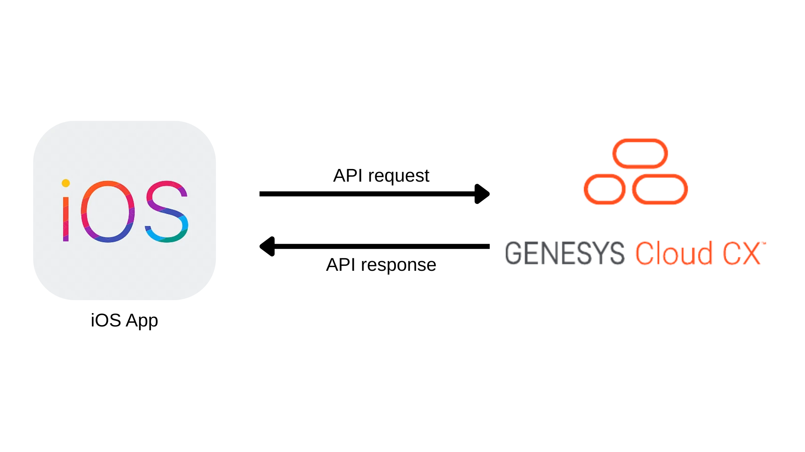

# Develop an iOS App for Basic Agent Monitoring

View the [Develop an iOS App for basic agent monitoring blueprint](./blueprint/index.md).

This Genesys Cloud Developer Blueprint demonstrates how to include the Genesys Cloud Platform API Client SDK - iOS in a SwiftUI project. This solution includes a sample iOS app that allows supervisors to monitor the agents' statuses.

## Sample iOS App

This solution includes a sample iOS app that uses the Genesys Cloud Platform API Client SDK - iOS to display the user and routing status of queue members.

To authenticate in a Genesys Cloud region other than mypurecloud.com, configure the environment in the app settings.

For example:
- Set environment to: `mypurecloud.ie`

You can view the complete blueprint and download the sample app files from [here](./blueprint/index.md)
