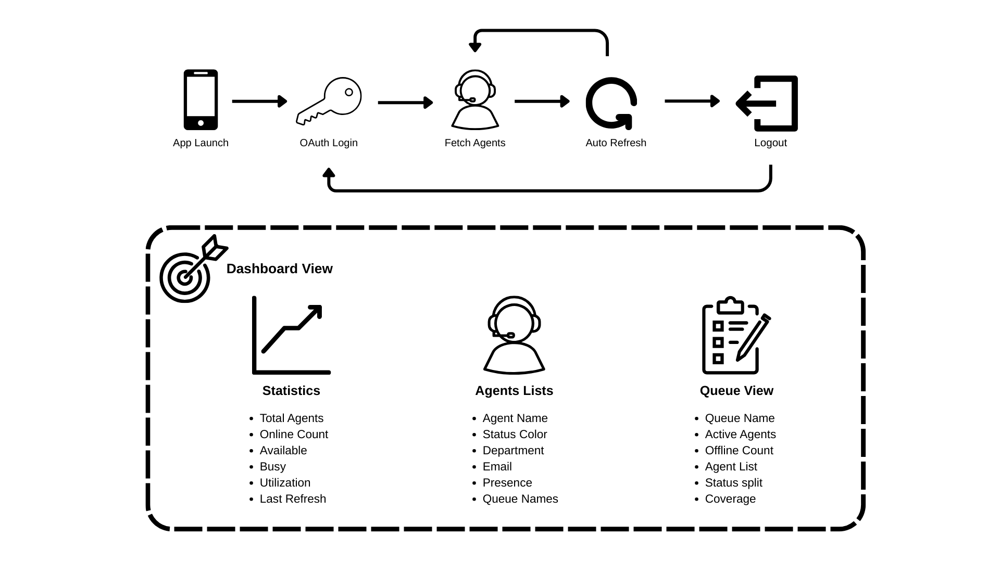

# Develop an iOS App for Real-Time Agent Monitoring

This Genesys Cloud Developer Blueprint demonstrates how to include the Genesys Cloud Platform API Client SDK for iOS in a SwiftUI project. This solution includes a sample iOS app that allows supervisors to monitor agent statuses, presence information, and queue assignments in real-time.



## Solution components

- **Genesys Cloud** - A suite of Genesys cloud services for enterprise-grade communications, collaboration, and contact center management. In this solution, you require a Genesys Cloud OAuth client to authorize the iOS app integration with Genesys Cloud.
- **SwiftUI** - Apple's declarative framework for building native iOS user interfaces.
- **CocoaPods** - Dependency manager for Swift and Objective-C projects used to integrate the Genesys Cloud SDK.

## Software development kit (SDK)

**Genesys Cloud Platform API Client SDK for iOS (PureCloudPlatformClientV2)** - Client libraries handle the low-level HTTP requests and simplify the application integration with Genesys Cloud. In this solution, the iOS SDK authenticates using OAuth 2.0 client credentials and performs the API calls required to retrieve agent presence, user information, and routing data.

## Prerequisites

### Specialized knowledge

- Administrator-level knowledge of Genesys Cloud
- Familiarity with the Genesys Cloud Platform API and the Genesys Cloud Platform API Client SDK for iOS
- Experience using Swift and SwiftUI
- Familiarity with Xcode and CocoaPods

### Genesys Cloud account requirements

- A Genesys Cloud license. For more information, see [Genesys Cloud Pricing](https://www.genesys.com/pricing).
- Master Admin role or Developer role in Genesys Cloud. For more information, see [Roles and permissions overview](https://help.mypurecloud.com/articles/about-roles-permissions/) in the Genesys Cloud Resource Center.
- OAuth client with Client Credentials grant type. For more information, see [Create an OAuth client](https://help.mypurecloud.com/articles/create-an-oauth-client/) in the Genesys Cloud Resource Center.
- The following OAuth scopes:
  - **users:read** - View agent information
  - **presence:read** - View agent presence status
  - **routing:read** - View queue assignments

## Sample iOS app

The blueprint includes a sample iOS app that uses the Genesys Cloud Platform API Client SDK for iOS to monitor agents in real-time. The app features three main views:

- **Dashboard** - Displays real-time statistics including total agents, online count, available and busy agents, team utilization percentage, and active queue information with summary cards.
- **Agents** - Shows a detailed list of all agents with their current presence status, department, email, and assigned queues. Each agent row displays a color-coded status indicator (green for Available, red for Busy, orange for Away, gray for Offline).
- **Queues** - Provides an overview of all active queues with agent distribution, status breakdowns per queue, and detailed information about which agents are assigned to each queue. Displays active and offline agents separately.

The app automatically refreshes every 30 seconds to provide live monitoring. Users can also manually refresh by pulling down on any view. If an agent's status changes, the display updates accordingly.

:::primary
**Note:** The iOS project is created using SwiftUI with CocoaPods for dependency management. If you are using this as a reference for your existing iOS project, there can be differences in project structure and configuration.
:::

## Genesys Cloud service

In the sample iOS app, the `ContentView.swift` file contains all the Genesys Cloud-related functionality, including:

- OAuth 2.0 authentication using client credentials
- UsersAPI integration to retrieve agent information
- PresenceAPI integration to fetch real-time agent presence status
- Data processing and UI state management
- Auto-refresh timer implementation

## Run the sample iOS app

You can run the sample iOS app locally using Xcode.

**Note:** A Genesys Cloud OAuth client with appropriate permissions is mandatory for the app to work.

### Run the app locally

1. Clone the GitHub repository to your local machine:

   ```bash
   git clone https://github.com/GenesysCloudBlueprints/genesys-cloud-platform-ios-sdk-sample-app
   ```

2. Navigate to the project directory:

   ```bash
   cd genesys-cloud-platform-ios-sdk-sample-app
   ```

3. Install dependencies using CocoaPods:

   ```bash
   pod install
   ```

4. Navigate to the app directory and open the workspace in Xcode (not the .xcodeproj file):

   ```bash
   cd genesys-cloud-platform-ios-sdk-sample-app
   open GenesysCloudConnectDemo.xcworkspace
   ```

5. Build and run the app in Xcode (⌘+R) on a simulator or physical device.

6. When the app launches, enter your OAuth credentials in the Setup tab:

   

   - **Environment**: Your Genesys Cloud environment base path (e.g., `https://api.mypurecloud.com`, `https://api.mypurecloud.ie`, `https://api.mypurecloud.com.au`)
   - **Client ID**: Your OAuth client ID
   - **Client Secret**: Your OAuth client secret

7. Tap "Start Agent Monitoring" to authenticate and begin monitoring agents.

   

   

## Implementation steps

The following instructions describe how to create a new iOS project with SwiftUI and the additional configuration required to work with the Genesys Cloud Platform API Client SDK for iOS.

### Create a Client Credentials OAuth client in Genesys Cloud

To authorize your iOS app with the Genesys Cloud SDK, create a Client Credentials OAuth client with the following settings:

- **Grant type**: Client Credentials
- **Scopes**:
  - users:read
  - presence:read
  - routing:read

Note the client ID and client secret for later use to configure your project.

For more information, see [Create an OAuth client](https://help.mypurecloud.com/articles/create-an-oauth-client/) in the Genesys Cloud Resource Center.

### Prepare iOS development environment

1. Install Xcode from the Mac App Store (version 13.0 or later recommended).

2. Install CocoaPods if not already installed:

   ```bash
   sudo gem install cocoapods
   ```

3. Create a new iOS project in Xcode:
   - Open Xcode and select "Create a new Xcode project"
   - Choose "iOS" → "App"
   - Select "SwiftUI" as the interface
   - Choose "Swift" as the language
   - Set the minimum deployment target to iOS 13.0 or later

### Install the Genesys Cloud SDK

1. Create a Podfile in your project directory:

   ```bash
   pod init
   ```

2. Edit the Podfile and add the Genesys Cloud SDK:

   ```ruby
   platform :ios, '13.0'

   target 'YourAppName' do
     use_frameworks!
     pod 'PureCloudPlatformClientV2'
   end
   ```

3. Install the pod:

   ```bash
   pod install
   ```

4. Close your .xcodeproj file and open the .xcworkspace file instead:

   ```bash
   open YourAppName.xcworkspace
   ```

   :::primary
   **Important:** Always use the .xcworkspace file when working with CocoaPods, not the .xcodeproj file.
   :::

### Import the Genesys Cloud Platform API Client SDK for iOS into your project

Import and use the Genesys Cloud Platform API Client SDK for iOS in your SwiftUI project. For example:

```swift
import PureCloudPlatformClientV2

// Configure SDK with access token and environment
PureCloudPlatformClientV2API.accessToken = yourAccessToken
PureCloudPlatformClientV2API.basePath = "https://api.mypurecloud.com"
```

Use the different API tools available in the SDK:

```swift
// Authenticate with Genesys Cloud using OAuth 2.0 client credentials
func requestOAuthToken(completion: @escaping (Result<String, Error>) -> Void) {
    let loginURL = environmentBasePath.replacingOccurrences(of: "api.", with: "login.")
    let tokenURL = URL(string: "\(loginURL)/oauth/token")!
    
    var request = URLRequest(url: tokenURL)
    request.httpMethod = "POST"
    request.setValue("application/x-www-form-urlencoded", forHTTPHeaderField: "Content-Type")
    
    let credentials = "\(clientId):\(clientSecret)"
    let base64Credentials = credentials.data(using: .utf8)!.base64EncodedString()
    request.setValue("Basic \(base64Credentials)", forHTTPHeaderField: "Authorization")
    
    let bodyString = "grant_type=client_credentials&scope=users:read routing:read presence:read"
    request.httpBody = bodyString.data(using: .utf8)
    
    URLSession.shared.dataTask(with: request) { data, response, error in
        if let error = error {
            completion(.failure(error))
            return
        }
        
        guard let data = data,
              let json = try? JSONSerialization.jsonObject(with: data) as? [String: Any],
              let accessToken = json["access_token"] as? String else {
            completion(.failure(NSError(domain: "TokenError", code: 0)))
            return
        }
        
        completion(.success(accessToken))
    }.resume()
}

// Get users (agents) from Genesys Cloud
UsersAPI.getUsers(pageSize: 100, pageNumber: 1) { (response, error) in
    if let error = error {
        print("Error loading users: \(error)")
        return
    }
    
    guard let userEntityListing = response else {
        print("No user data received")
        return
    }
    
    // Process users
    let users = userEntityListing.entities ?? []
}

// Get presence for a specific user
PresenceAPI.getUserPresence(userId: userId, sourceId: "PURECLOUD") { (userPresence, error) in
    if let error = error {
        print("Error loading presence: \(error)")
        return
    }
    
    if let presence = userPresence,
       let presenceDefinition = presence.presenceDefinition {
        let status = presenceDefinition.systemPresence ?? "Unknown"
        // Update UI with presence status
    }
}
```

## Troubleshooting

### Authentication issues

**Problem:** "Invalid Client ID or Secret" error

**Solutions:**
- Verify your Client ID and Client Secret are correct
- Ensure there are no extra spaces when copying credentials
- Confirm the OAuth client is active in Genesys Cloud Admin
- Check that you're using the correct environment URL for your region

**Problem:** "Permission denied" or "403 Forbidden" error

**Solution:**
- Verify your OAuth client has all required scopes:
  - users:read
  - presence:read
  - routing:read
- Ensure your Genesys Cloud user has Master Admin or Developer role
- Regenerate the client secret if permissions were recently changed

### Build and installation issues

**Problem:** "No such module 'PureCloudPlatformClientV2'" error

**Solution:**
- Ensure you ran `pod install` successfully
- Verify you're opening the `.xcworkspace` file, not the `.xcodeproj` file
- Clean build folder in Xcode (⌘+Shift+K) and rebuild
- Try running `pod deintegrate` then `pod install` again

**Problem:** CocoaPods installation fails

**Solution:**
- Update CocoaPods: `sudo gem install cocoapods`
- Update pod repo: `pod repo update`
- Check your Ruby version: `ruby --version` (should be 2.6 or later)
- Try clearing CocoaPods cache: `pod cache clean --all`

### Runtime issues

**Problem:** App shows "No agents found" or empty lists

**Solution:**
- Verify your Genesys Cloud organization has active users
- Check that users are assigned to queues
- Confirm your OAuth client has the correct permissions
- Review the Xcode console for API error messages

**Problem:** App crashes on launch or during authentication

**Solution:**
- Check Xcode console for error messages
- Verify your environment URL is correct (e.g., `https://api.mypurecloud.com`)
- Ensure you have a stable internet connection
- Try deleting the app and reinstalling

**Problem:** Agent status not updating

**Solution:**
- Check that auto-refresh is working (should update every 30 seconds)
- Manually pull down to refresh
- Verify agents are actually changing status in Genesys Cloud
- Check Xcode console for API call errors

### Environment and region issues

**Problem:** "API endpoint not found" or "404" errors

**Solution:**
- Verify you're using the correct environment URL for your region. For a complete list of Genesys Cloud regions and their corresponding URLs, see [AWS regions for Genesys Cloud deployment](https://help.mypurecloud.com/articles/aws-regions-for-genesys-cloud-deployment/) in the Genesys Cloud Resource Center.
- Ensure the login URL matches your API URL (replace `api.` with `login.`)

## Additional resources

- [Genesys Cloud Platform API Client SDK for iOS](https://developer.genesys.cloud/devapps/sdk/docexplorer/purecloudios/) in the Genesys Cloud Developer Center
- [Sample iOS App in GitHub](https://github.com/GenesysCloudBlueprints/genesys-cloud-platform-ios-sdk-sample-app)
- [SwiftUI Documentation](https://developer.apple.com/documentation/swiftui/) in the Apple Developer website
- [CocoaPods](https://cocoapods.org/) home page
